# Movie Archive

A full-stack web application for discovering, tracking, and rating movies and TV series. Users browse a curated catalogue, maintain personal watchlists, record watch history, and rate titles with written reviews. Administrators grow the catalogue via CSV upload and a background OMDb sync that enriches every title with metadata, posters, cast, and — for TV series — full season/episode breakdowns.

> **Course:** Software Architecture — Semester 6
> **Stack:** FastAPI · MySQL · React 18 · Vite · Bootstrap 5

---

## Tech Stack

| Layer | Technology |
|-------|-----------|
| Backend | FastAPI + SQLModel + PyMySQL |
| Frontend | React 18 + Vite + Bootstrap 5 |
| Database | MySQL (15 tables, 7 stored procedures) |
| Auth | JWT Bearer tokens (python-jose + passlib/bcrypt) |
| External API | OMDb API via httpx.AsyncClient |

---

## Features

### Public
- Browse and filter the catalogue by genre, year, rating, and free-text search
- Full show detail — poster, plot, cast, genres, IMDb rating, platform average, and user reviews
- TV series: seasons and episodes accordion

### Authenticated Users
- Register / login with JWT auth; passwords hashed with bcrypt
- Rate and review titles (1–10); rating auto-marks as watched
- Mark as watched without rating
- Create, manage, and delete personal watchlists
- View full watch history with ratings and review excerpts

### Admin Only
- Bulk-upload IMDb IDs via CSV
- OMDb background sync with real-time progress bar (polled every 2 s)
- Sync Missing Only mode — only processes titles with incomplete metadata
- Create tags and apply them to titles

---

## Screenshots

### Browsing & Discovery

| Browse Catalogue | Filters Applied | Logged-in View |
|---|---|---|
|  | 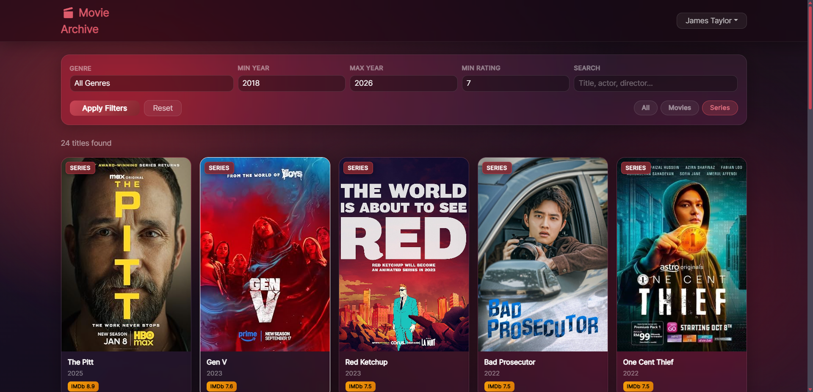 |  |

### Show Detail & Trailer

| Movie Detail | TV Series Detail (Seasons) | Watch Trailer Button | Trailer Modal |
|---|---|---|---|
| 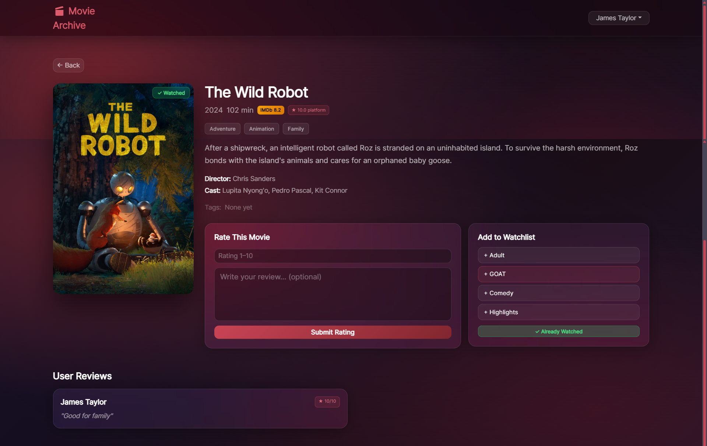 | 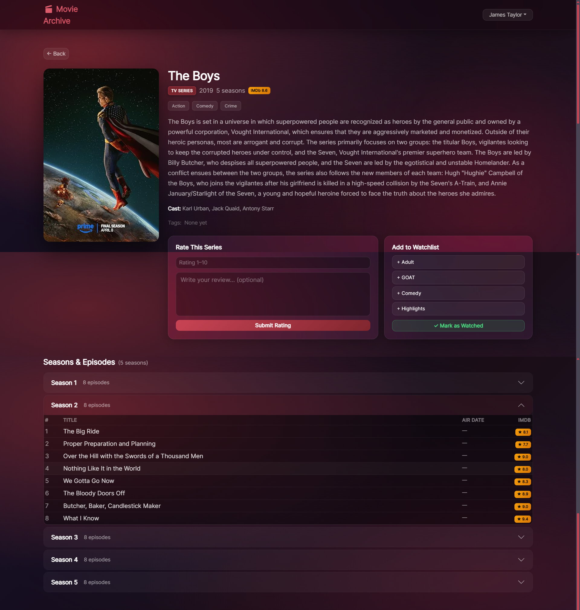 | 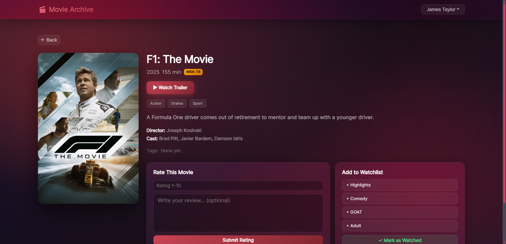 | 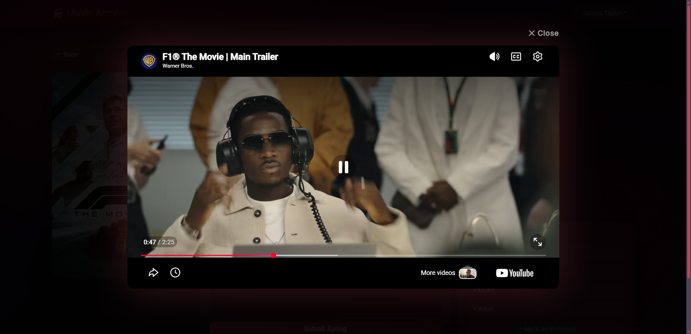 |

### Authentication

| Login | Register | User Menu | Admin Menu |
|---|---|---|---|
| 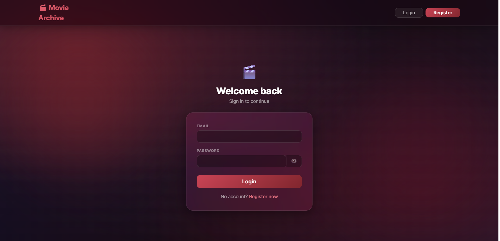 | 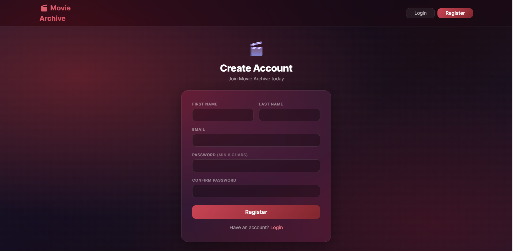 |  | 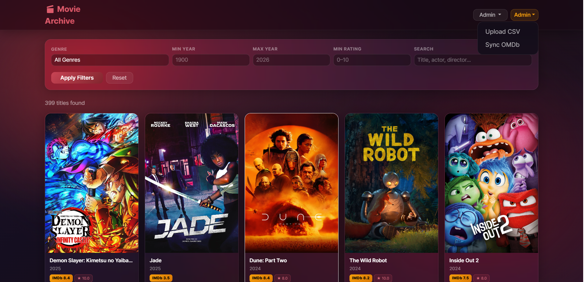 |

### Watchlists & History

| My Watchlists | Watchlist Detail | Watch History |
|---|---|---|
| 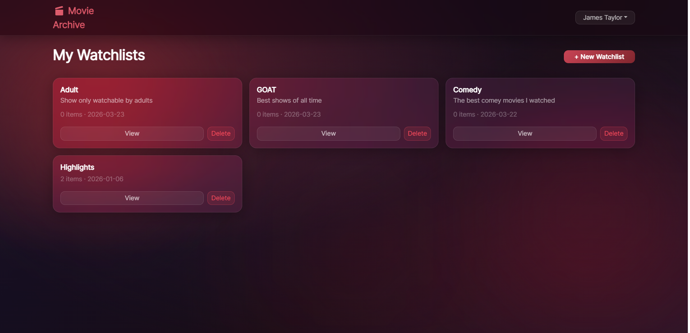 | 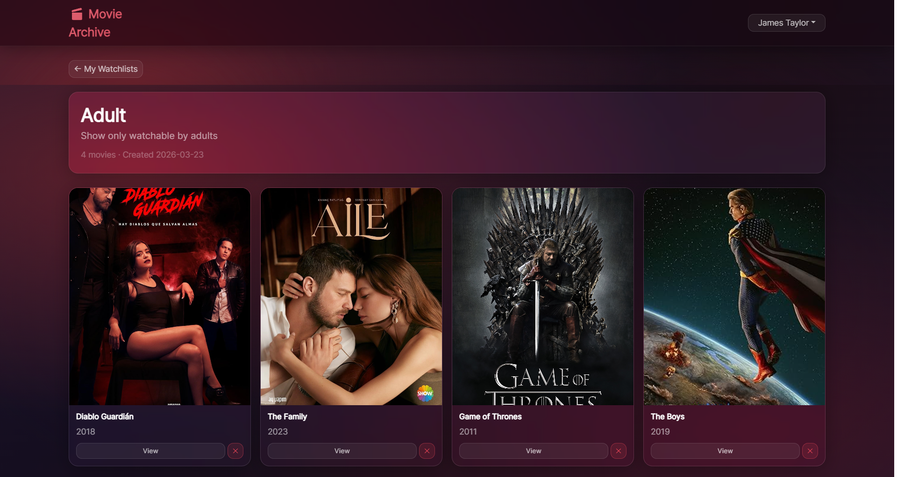 | 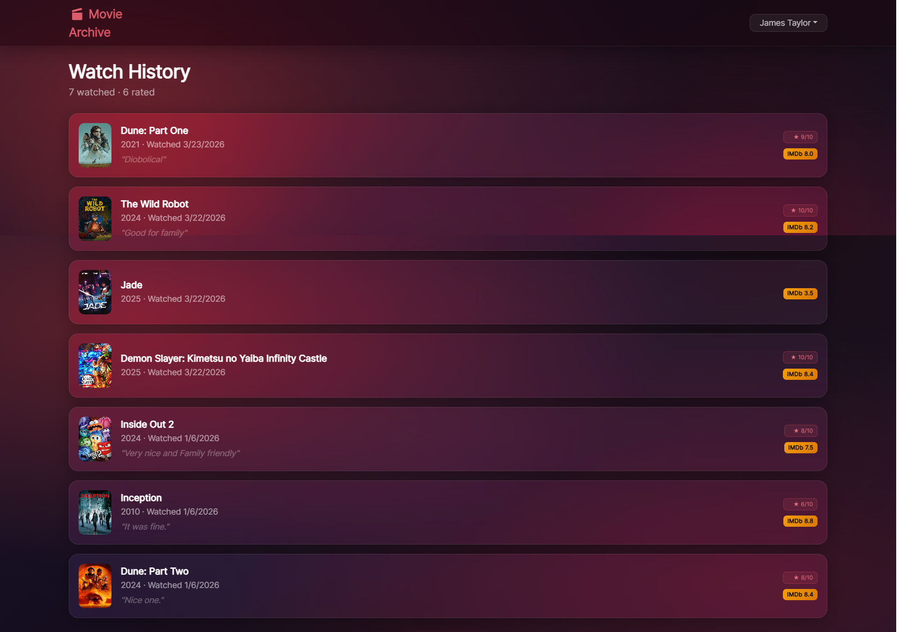 |

### Admin Tools

| CSV Upload | Upload Result | Sync Running | Sync Complete |
|---|---|---|---|
| 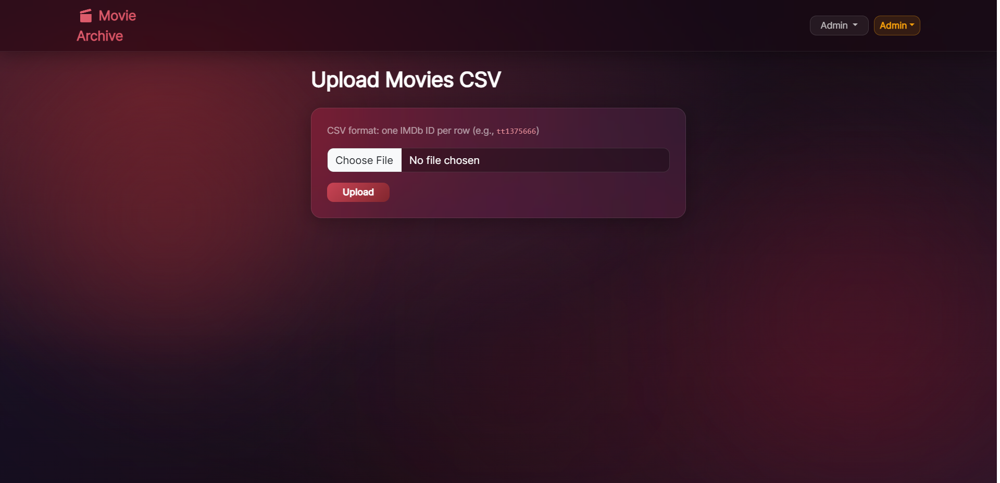 | 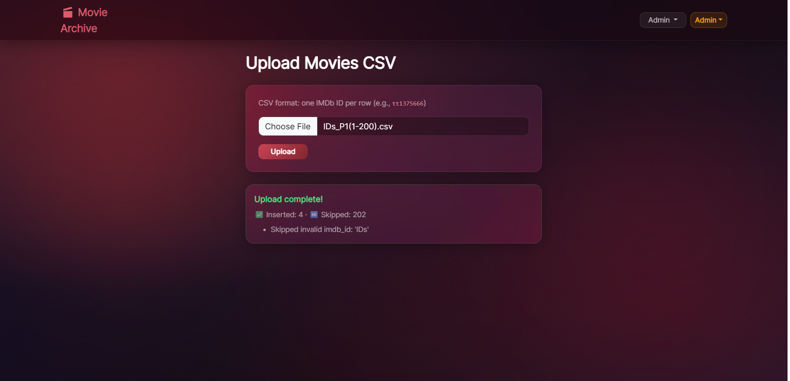 | 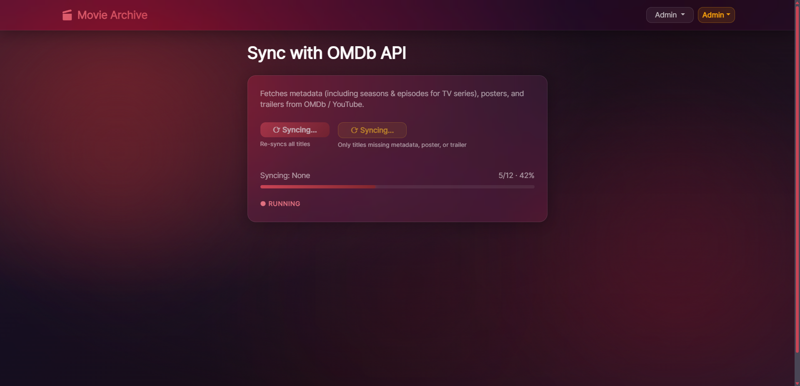 | 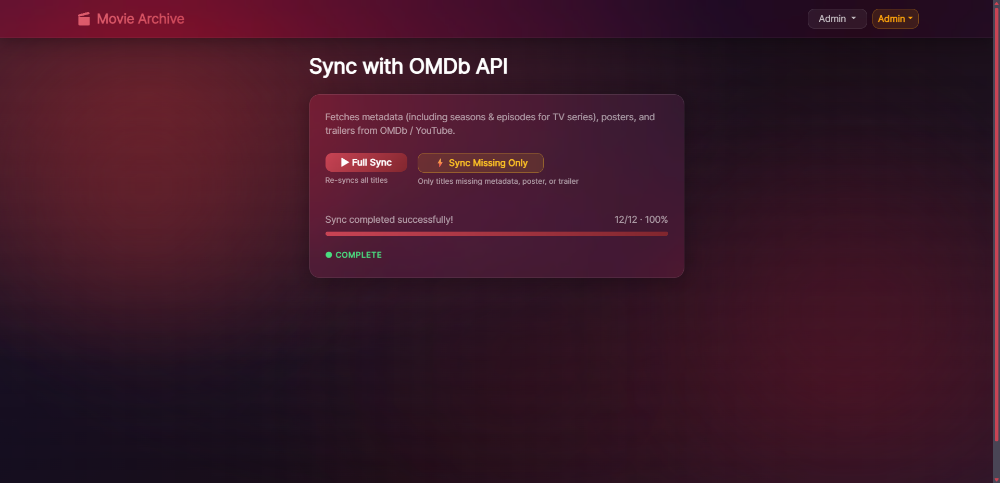 |

---

## Project Structure

```
movie_archive/
├── backend/
│   ├── main.py             # App entry point, CORS, lifespan, router registration
│   ├── config.py           # Pydantic-Settings — loads .env
│   ├── database.py         # SQLAlchemy engine + get_session dependency
│   ├── models.py           # 15 SQLModel table classes
│   ├── schemas.py          # Pydantic request/response schemas
│   ├── services.py         # All business logic (fat service, thin routes)
│   ├── dependencies.py     # get_current_user, get_optional_user, require_admin
│   ├── requirements.txt
│   └── routers/            # One file per resource (shows, ratings, watchlists, …)
├── frontend/
│   └── src/
│       ├── api/client.js   # Axios instance with JWT interceptor
│       ├── context/        # AuthContext — global JWT state
│       ├── components/     # Navbar, MovieCard, PosterImage, ErrorBanner
│       └── pages/          # HomePage, ShowDetailPage, LoginPage, RegisterPage,
│                           # WatchlistsPage, WatchlistDetailPage, HistoryPage,
│                           # AdminUploadPage, AdminSyncPage
├── db/
│   ├── 1- Movie_Archive_DB.sql   # All CREATE TABLE + migrations
│   ├── 2- Stored_Procedures.sql  # Stored procedures
│   └── 3- Sample_Data.sql        # Seed data
├── responsibilities/       # Per-student responsibility files
└── REPORT.md               # Full project report
```

---

## How to Run

### Prerequisites

| Tool | Version |
|------|---------|
| Python | 3.11+ |
| Node.js | 20+ |
| MySQL | 8.0+ |

### Step 1 — Database

Run the SQL files **in order** against a running MySQL instance:

```bash
mysql -u root -p < "db/1- Movie_Archive_DB.sql"
mysql -u root -p movie_archive < "db/2- Stored_Procedures.sql"
mysql -u root -p movie_archive < "db/3- Sample_Data.sql"
```

| File | Contents |
|------|----------|
| `1- Movie_Archive_DB.sql` | Creates the database and all 15 tables with constraints and indexes |
| `2- Stored_Procedures.sql` | Stored procedures: `sp_rate_show`, `sp_mark_as_watched`, `sp_create_watchlist`, etc. |
| `3- Sample_Data.sql` | Seed data: 8 users, 18 movies, genres, cast, watchlists, ratings, and tags |

### Step 2 — Backend

```bash
cd backend
python -m venv venv
source venv/bin/activate      # Windows: venv\Scripts\activate
pip install -r requirements.txt
```

Create `backend/.env`:

```env
DB_HOST=localhost
DB_PORT=3306
DB_USER=root
DB_PASSWORD=your_password
DB_NAME=movie_archive
SECRET_KEY=your_jwt_secret_key
ALGORITHM=HS256
ACCESS_TOKEN_EXPIRE_MINUTES=1440
OMDB_API_KEY=your_omdb_key
ADMIN_USER_ID=1
```

```bash
uvicorn main:app --reload   # http://localhost:8000
```

Interactive API docs: `http://localhost:8000/docs`

### Step 3 — Frontend

```bash
cd frontend
npm install
npm run dev   # http://localhost:5173
```

### Default Admin Account

```
Email:    admin@moviearchive.com
Password: admin.movie.archive
```

---

## Database Schema

15 tables in a normalised relational model:

```
users ──< watchlists ──< watchlist_items >── shows
                                              │
                                              ├──< show_genres    >── genres
                                              ├──< show_directors >── directors
                                              ├──< show_actors    >── actors
                                              ├──< show_tags      >── tags
                                              └──< seasons ───────< episodes

users ──< user_ratings  >── shows
users ──< watch_history >── shows
```

Key constraints: composite primary keys on all join tables, `ON DELETE CASCADE` on all foreign keys, `UNIQUE(user_id, show_id)` on `user_ratings` and `watch_history`, `CHECK (rating BETWEEN 1 AND 10)`.

---

## Key Concepts

### JWT Authentication
Tokens signed with HS256 via `python-jose`. A `get_current_user` dependency validates every protected route; `require_admin` extends it for admin-only endpoints.

### Validation — Four Layers
| Layer | Mechanism |
|-------|-----------|
| HTML5 | `required`, `type`, `min`/`max`, `minLength` |
| React (JS) | Client-side checks before API call (e.g. password confirmation) |
| Pydantic | `Field()` constraints, regex patterns, `@model_validator` |
| Database | `CHECK`, `UNIQUE`, `BETWEEN`, FK constraints, stored proc guards |

### OMDb Sync
CSV upload registers IMDb IDs; the admin then triggers a background sync (`BackgroundTasks`) that hits the OMDb API for each title and updates title, plot, rating, runtime, genres, cast, directors, poster URL, and — for TV series — all seasons and episodes. The frontend polls `/admin/sync/status` every 2 seconds to display live progress.

### Poster Fallback
During sync, if a show has no `poster_url`, the backend extracts the `Poster` field from the OMDb API response and saves it to the database. The frontend `PosterImage` component simply renders `poster_url` and hides the image on load error.

### React Architecture
- `AuthContext` provides global JWT state to all components without prop drilling
- Axios interceptor automatically attaches `Authorization: Bearer {token}` to every request
- `useEffect` with a `[]` dependency array fetches data on mount; protected pages redirect to `/login` if unauthenticated
- `useState` drives all dynamic UI — filters, loading spinners, error banners, hover states

---

*See [REPORT.md](REPORT.md) for the full project report including detailed code examples for all Week 1–4 concepts.*
